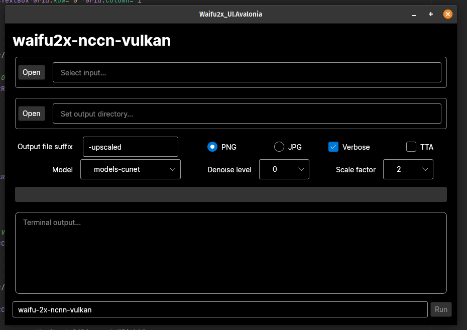

# waifu-2x-nccn-vulkan-gui

- GUI frontend for [waifu-2x-nccn-vulkan](https://github.com/nihui/waifu2x-ncnn-vulkan), created by nihui
- Batch processing available
- No dependencies, download and run

You can use this to upscale images (particularly drawings, rather than photographs).

nccn-vulkan is self-contained, so you should't need to install any other dependencies to get it working.

This is a thin wrapper around the console app, so it provides a live preview of what command is going to be run.

Select multiple images to process them all, one at a time.

## Installation

Currently there are only pre-compiled binaries which you can find in the Releases tab.

Download the archive, extract it, mark the file as executable and open it.

Currently I've only compiled it for Linux, but it would probably work alright on Windows or OSX with minor tweaks.

## Building

This project was built with .NET 6 and Avalonia. 

If you have both of those installed, there's nothing weird with the build so you should be able to just clone and build the solution.

## Contributions

Highly welcome!
